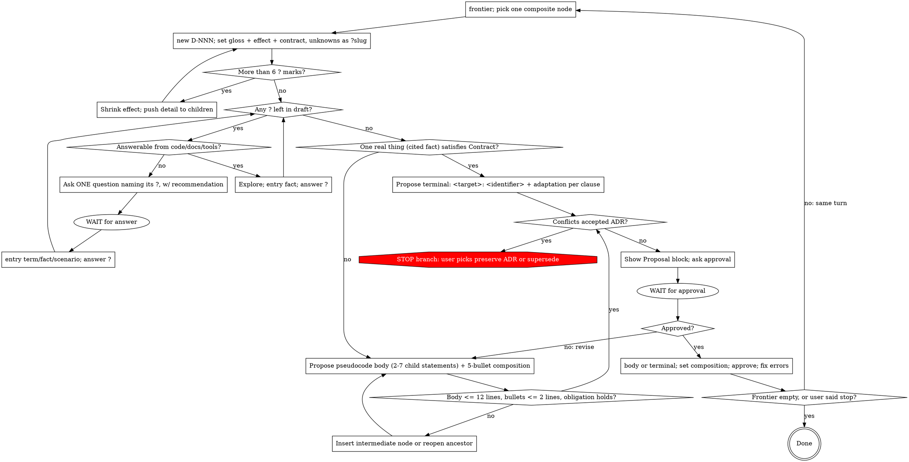

# Constructing Software Stepwise

Stepwise refinement (Dijkstra EWD249/EWD340, Wirth CACM 1971): minute steps, decide as little as possible per step, proof grows with program, representation deferred, back up to any ancestor when needed. Spec not given here → interview builds it, per node.

Cycle, this order: (1) pick ONE node (`frontier`), `new` it, `set` its abstract statement gloss + effect + contract ≤ 6 clauses, unknowns `?slug` → (2) one question per `?`, this node only; each answer → `entry` + `answer` → (3) propose ONE refinement: what the function does (≤ 3 lines) + pseudocode body, one line per tagged pseudocode line + composition argument → (4) user answers accept / make terminal / changes → (5) `body` (or `terminal`) + `set walkthrough` + `set composition` + `approve` → pick next node, same turn. Turn ends only at a question or a Proposal block; loop runs until frontier empty or user says stop.

Design is pseudocode until a node is terminal; only there adapt to the real thing — language construct, framework API, platform primitive, service, infra, existing repo fn — written `<target>: <identifier>`. `DESIGN.md ## Program` = whole design, every approved body substituted in place, pseudo + realized lines mixed — a view rendered from `ledger.json`. Evidence lives inside the node it verifies.

Small refinement → small contract → small vocabulary. Many questions = scope leaking from children.

## Pacing — hard rules

| Rule | Observable test |
|---|---|
| One refinement per approval | Turn proposes children for exactly one node |
| Draft before ask | Node exists (`new`), gloss + effect + contract ≤ 6 clauses (1–2 explicit lines each) set, unknowns `?slug`, before first question |
| Interview bounded | Every question names the `?` it clears. No `?` → no question → `ambiguity … D-NNN` row for the child that owns it |
| Scope leak gauge | `?` > 6 at draft → shrink effect, push detail to children, redraft. Questions per node ≤ initial `?` count |
| Interview before proposal | No children while draft has any `?` or open user-owned decision |
| One question per turn | Exactly one question to user. Then wait |
| Turn ends only at WAIT | Two stops: after a question, after a Proposal block (plus ADR STOP). Answer → `entry` + `answer` → next `?` or Proposal, same turn. Approval → persist → pick next node → draft → question or Proposal, same turn. Never end a turn on a summary |
| Run to empty frontier | Default depth = whole tree: every leaf terminal or collapsed. Stop earlier only when user says stop or names a bound (`design only`, `to D-0xx`) |
| Approval explicit | Yes to shown Proposal block. Agreement to prose ≠ approval → show block, ask |
| Step small | Refinement body ≤ 12 pseudocode lines; each composition bullet ≤ 2 lines. Longer → insert intermediate node |
| Pseudocode until terminal | Language keyword, library name, or concrete type in composite node = premature representation → move to child |
| Terminal at platform | Contract already met by ONE real thing cited in a fact (idempotent start by key, resume from checkpoint, CAS, lock, retry, version pin) → terminal now, `adaptation` per clause. Never refine platform guarantee into pseudocode |
| Write through the CLI | Every change to the ledger is one `stepwise.py` verb; the only hand-written text is an ADR paragraph. A verb that exits 1 is fixed (more verbs) before the next question or Proposal. `ledger.json`, `DESIGN.md`, `CONTEXT.md`, `nodes/*.md` are never opened in an editor |
| Back up freely | Obligation fails → revise children or `reopen` ancestor |

## Node Kinds

| Kind | Test | Verbs |
|---|---|---|
| Terminal | Statement = ONE real thing that exists outside the design today (language construct / framework API / platform primitive / managed service / repo fn on disk), or Contract already met by ONE such thing cited in a fact | `terminal D-NNN "<target>: <identifier>"` + `set adaptation` (clause → concrete construct) + `approve`; later `evidence` |
| Leaf — collapsed | User says not worth digging | `body` to real lines (≤ 12, each `-- ⇒ <target>: <identifier> -- <one line>`, no children) + `set walkthrough` + `set composition` + `approve` |
| Terminal — reuse | Statement = call to existing node with `design: approved`, its Statement + Contract verbatim | no new node; body line `-- ↗ D-NNN`; parents derive |
| Composite | else | `body` (2–7 child statements, each `-- D-NNN: <one line>`) + `set walkthrough` + `set composition` (+ `decisions`, `deferred`) + `approve`; every field in [design-ledger.md](references/design-ledger.md) |

Composite → 2–7 child statements. 1 = rename. >7 = missing intermediate node. Terminal = where refinement stops: adapt to real, or call approved node. Terminal test runs before every body: one real thing (cited fact) satisfies Contract → terminal, `adaptation` maps each clause onto it. Decomposing what the platform guarantees = re-deriving it; five levels of get-or-start / CAS / schedule above `dbos: startWorkflow` = this failure. Own unwritten code (`service: AgentLedger.read`) is not a real thing — it is the design; `terminal` refuses it. Adaptation that restates Contract verbs is not adaptation. User rules "not worth digging" → collapsed leaf: review collapses, refinement does not; body still reaches real constructs line by line, > 12 lines means it was worth digging. Reused node's body appears once in `Program ### Procedures`; call sites point at it. "Trivial / obvious / clear enough" not decision words; tables decide.

## Durable Artifacts

Repo convention wins; else:

```text
docs/design/<topic>/
  ledger.json           canonical: nodes, terms, facts, scenarios, scope, ambiguities — written only by stepwise.py
  DESIGN.md             view: root, frontier, ADRs, node table, Program (whole pseudocode, bodies substituted)
  CONTEXT.md            view: scope, term/fact/scenario tables, open ambiguities, non-goals, every entry
  nodes/D-NNN.md        view: one node — statement, contract, refinement, evidence, history
docs/adr/NNNN-<slug>.md   one decision = one file; stub + status by the tool, paragraph by hand
```

| Dimension | Record | Why | Verbs | Format |
|---|---|---|---|---|
| Meaning | `terms` / `facts` / `scenarios` entries | edited in place; dated `changed` list | `entry`, `change`, `meta`, `ambiguity` | [context-ledger.md](references/context-ledger.md) |
| Design + evidence | node record; evidence list | status by verb only; history keeps reasons | `new`, `set`, `body`, `answer`, `terminal`, `approve`, `reopen`, `stale`, `supersede`, `evidence` | [design-ledger.md](references/design-ledger.md) |
| Decision | ADR markdown | supersede, never rewrite | `adr new`, `adr accept`, `adr supersede`, `adr constrains` | [adr-ledger.md](references/adr-ledger.md) |

Voice — chat vs artifacts. Chat may be terse. Everything the verbs persist — gloss, effect, contract clause, walkthrough, body line explanation, composition bullet, decision, entry definition, ADR paragraph — is written for an engineer who was not in this session and has only the file:
- Full sentences, exact nouns. Name the thing every time; no `it`, `this`, `the above`, no pronoun whose referent lives in the chat.
- Self-contained: readable without the session, the parent node, or the question that produced it. Refer to other records by name (`Run Key`, `CTX-F04`, `D-060`) so the view links them.
- Precise over short. Never drop articles, conjunctions, or a qualifier to save a line; state the condition, the scope, and what holds. Length caps (≤ 3 walkthrough lines, ≤ 2 bullet lines, 1–2 clause lines) bound the thought, not the grammar — thought too big for the cap → split the node, never compress the prose.
- No `obviously`, `simply`, `trivially`, `just`, `should be fine`, `TBD`. An unknown is a `?slug`, an `ambiguity` row, or a `deferred` bullet, never a vague phrase.

Rules:
- One claim per record. Two citable statements → two entries.
- Name = identity: `Run Key`, `CTX-F01`, `D-060`, `ADR-0002`. Use the name in `set`, `answer`, `--not`, `--settles`; views render links. No paths, no anchors, ever.
- Definition 1–2 sentences, what it IS. Canonical term + `--avoid` aliases.
- Caps (lint): contract ≤ 6 clauses, body ≤ 12 statements, ADR ≤ 40 lines. Over → split.
- Parents, frontier, `Used by`, links, status words, dates, tags, tables, Program — all derived. Nothing typed twice.

## Tooling — `scripts/stepwise.py` (python 3, stdlib, no regex, any agent)

`<dir>` = `docs/design/<topic>`. Script lives in this skill's `scripts/`; `python3 <skill>/scripts/stepwise.py <verb> <dir> …`. Every verb renders the views and lints; exit 1 + `error …` lines mean fix with more verbs, never with an editor. `.stepwise.log` records every call.

| Phase | Verb | Effect |
|---|---|---|
| orient | `frontier <dir>` · `show <dir> D-NNN` | what to pick; one node view |
| draft | `new <dir> D-NNN ["stmt"]` | node from frontier line (root: pass statement) |
| draft | `set <dir> D-NNN gloss\|effect "…"` · `set <dir> D-NNN pre\|post\|failure\|invariant\|<any lowercase label> "…"` | prose + contract clause (≤ 6; labels free: `budget`, `determinism`, `boundary` …); `?slug` allowed |
| interview | `entry <dir> term\|fact\|scenario "Name" "definition" [--source --avoid --not --example \| --given --when --then --excludes --settles]` | context entry; ids allocated |
| interview | `answer <dir> D-NNN slug "Name"` · `set <dir> D-NNN depends "Name" …` | `?slug` → name in every clause; depends += name. `set depends` for a dependency with no `?` (e.g. a fact born later) |
| interview | `ambiguity <dir> "claim" "conflict" D-NNN` · `meta <dir> scope\|title "…"` · `meta <dir> nongoals "a" "b"` | deferred question; scope; non-goals |
| propose→persist | `body <dir> D-NNN` (stdin heredoc or `--file`) | pseudocode body; tags `-- D-NNN` / `-- ↗ D-NNN` / `-- ⇒ target`; single-match calls auto-tagged |
| propose→persist | `set <dir> D-NNN walkthrough "l1" ["l2" "l3"]` | ≤ 3 lines: what the function does; rendered above the body |
| propose→persist | `set <dir> D-NNN composition\|decisions\|deferred "b1" "b2" …` | bullets, replace whole list |
| propose→persist | `terminal <dir> D-NNN "<target>: <identifier>"` · `set <dir> D-NNN adaptation "clause → construct" …` | leaf; Exists test enforced |
| persist | `approve <dir> D-NNN` | refuses on `?`, empty prose, no body/target, missing walkthrough, a tagged body line that says nothing about what it does, missing composition, untagged call, pending ADR; drops ambiguity rows resolving at this node; prints next frontier id |
| change | `reopen <dir> D-NNN "reason"` · `stale <dir> D-NNN "reason"` · `supersede <dir> D-OLD D-NEW "reason"` | status + history; `reopen` files the body it replaces under `## Superseded refinement` |
| change | `change <dir> <name\|CTX-id> [--definition …] [--rename "New heading"] [--status stale] --reason "…" [--minor]` | entry changed; approved dependents fail lint until `stale` / re-`approve` |
| decision | `adr <dir> new "Title" --constrains D-NNN[,D-MMM]` · `adr <dir> accept ADR-NNNN` | stub (nodes → `draft (ADR pending)`); accept unblocks |
| implement | `set <dir> D-NNN realization implemented` · `evidence <dir> D-NNN --kind K --ref R --result pass\|fail` | pass → `verified` |
| audit | `sync <dir>` · `check <dir>` | re-render after an ADR paragraph edit; lint only |

Lint covers: one root; status vocabulary; caps; untagged calls; reuse of non-approved node; Target format + Exists test; approved with `?` / no body / no walkthrough / unglossed body line / no composition / body changed / pending ADR; dependency names that do not exist; entry changed after approval; ADR constrains stale or missing node; ambiguity at approved node; hand-edited view. Judgment (contract, body, composition, questions) stays with agent + user.

## Core Loop



### 1. Ground + draft

Read `DESIGN.md`, `show` the active node, its depends, linked ADRs, code, tests, evidence. `frontier` → pick ONE composite node.

`new <dir> D-NNN` (root: `new <dir> D-000 "outcome <- run_agent(identity, objective)"`). Then `set` gloss (one line) + effect (1–2 sentences) + contract (≤ 6 clauses, 1–2 explicit lines each — Voice rules apply). Term / decision without entry on disk → `?slug` inside the clause. Draft = scope fence; interview fills only its holes. Root example, 4 `?`:

```bash
set D-000 gloss "one Agent Run carries one objective to exactly one terminal outcome, across process restarts"
set D-000 effect "One Agent Run ends in exactly one terminal outcome for its objective, and a restart of the process resumes that run rather than starting a second one."
set D-000 pre "The caller supplies a ?run-identity that names this run, and an objective that is complete before the run starts."
set D-000 post "Exactly one ?verified-result or one typed failure is recorded for the run, and it is recorded once no matter how many times the caller retries."
set D-000 failure "Every way the run can end badly is reported through one of the ?failure-channels; no failure escapes as an unhandled exception."
set D-000 invariant "No ?tool-effect is applied twice, including across a restart that replays the run."
```

Journal shape, budgets, tool ordering, cancellation → children's `?`. `?` > 6 → shrink effect, redraft.

### 2. Interview — one question per `?`

Goal: zero `?` in draft.

- Answerable from code / docs / tools / experiment → explore, never ask. Finding → `entry fact … --source <path|url>`, then `answer`.
- Else ONE question, shape below, naming its `?`. Wait.
- Each question carries recommended answer + one-line why.
- `?` whose prerequisite `?` unresolved waits.
- Challenge, don't transcribe: conflicts existing entry → "Glossary defines X as A; you mean B — which?"; vague → propose canonical; relationship → scenario probing edge; claim vs code → "Code does X; you said Y — which?"
- Each answer → `entry <kind> "Name" "definition" --source user …` → `answer D-NNN slug "Name"`. Same turn. Answer names an existing entry → `answer` alone.
- New term / question with no `?` → not this node. `ambiguity "<claim>" "<conflict>" D-NNN` for the child that owns it.
- Draft clause wrong → `set` it again (may add one `?`). Total `?` ever > 6 → §1, shrink effect.
- Done iff zero `?` and every user-owned decision draft names answered.

Never: batch questions; ask what code answers; ask without a `?`; propose children mid-interview.

```markdown
**Node:** D-NNN — <operation> · **Resolves:** ?<slug> in <clause> · **Left:** <k> of <n> ?
**Q:** <one question>
**Recommend:** <answer> — <one-line why>
**Else:** <alternative> — <trade-off, one line>
```

### 3. Propose ONE refinement

Terminal test first: one real thing, cited in a fact, satisfies the Contract → propose `<target>: <identifier>` + one adaptation line per clause, no body. Target must exist outside the design today; adaptation names query / call / type, not Contract verbs. User says not worth digging → collapsed leaf: propose full body to real lines (each `-- ⇒ <target>: <identifier>`, ≤ 12, no child tags) in one Proposal block. Else:

Say what the function does first: ≤ 3 lines, plain prose, above the body (`set walkthrough`). Then parent statement → body: pseudocode ≤ 12 lines, 2–7 child statements each tagged `-- D-NNN: <one line saying what that child does>` (next free ids), control structure (sequence / choice / loop) lives here, `{ assertion }` line wherever composition leans on a condition. Notation in [design-ledger.md](references/design-ledger.md). No language keyword, library, concrete type — representation, storage, framework → deepest node needing them. Every tagged line carries one line of plain explanation: `-- D-NNN: <one line>` for a child, `-- ↗ D-NNN -- <one line>` / `-- ⇒ <target>: <id> -- <one line>` elsewhere (a reused or existing node's own gloss counts). Child already exists as approved node → call it (`-- ↗ D-NNN`), Statement + Contract verbatim; contract doesn't fit → `reopen` it or new node, never a tweaked copy.

Composition argument (data flow / failures / cleanup / invariants / progress, ≤ 2 lines each) = proof obligation: body preserves parent `{Pre} S {Post}`. Checklist: Refinement Obligation. Fails → revise body or reopen ancestor.

Then STOP. Show block. Nothing else that turn.

~~~markdown
## Proposal — D-NNN — `<statement>`

**What it does**
<≤ 3 lines, plain prose>

**Contract**
- Pre: <…>
- Post: <…>
- Failure: <…>
- Invariant: <…>

**Refinement**
```pseudo
<statement>:
  x <- child_a(…)                  -- D-a: <one line>
  { assertion }
  loop until cond:
    child_b(x)                     -- D-b: <one line>
  -> child_c(x)                    -- D-c: <one line>
```

**Composition argument**
- Data flow: <≤ 2 lines>
- Failures: <≤ 2 lines>
- Cleanup: <≤ 2 lines | n/a: reason>
- Invariants: <≤ 2 lines>
- Progress: <≤ 2 lines | n/a: reason>

**Decisions**
- <one line each>

**Deferred**
- <claim> — <conflict> → D-x

**ADRs**
- <checked, none conflict | conflict → protocol>

**Approve D-NNN as above?**
1. Accept — persist it as proposed
2. Make terminal — expand every line of it down to real constructs, no child nodes left
3. Changes — say what to change
~~~

One clause per line, one bullet per item — never `Pre … · Post … · Failure …` strung across one line, in the Proposal or anywhere else. Each clause is 1–2 full lines, written so it can be checked without the rest of the design: name the thing, the condition on it, and what holds. `Post: exactly one row per Job Key survives, whatever the caller retried` beats `Post: row exists`. Clarity outranks brevity in a contract — never compress a clause into a fragment to save a line; split the node if six clear clauses do not fit.

End every Proposal with those three options, in that order, worded as they stand. Ask them the way the host lets you ask a multiple-choice question (Claude Code: `AskUserQuestion`; otherwise plain text); the user may always answer something else.

**Make terminal** = the user rules this branch not worth child-by-child review. Do not persist the composite body as proposed: re-propose the same node as a collapsed leaf — every statement written down to a real construct and tagged `-- ⇒ <target>: <identifier> -- <one line>`, ≤ 12 lines, no `-- D-NNN` tags, no children. Statements whose target you cannot name, or a body that runs past 12 lines, mean the branch was worth digging: say so, show the shortest composite that works, and ask again. A child that is already an approved node stays a call (`-- ↗ D-NNN`).

### 4. Approve + persist

User owns semantic / risk / compat / hard-to-reverse choices. Approval = Accept (or Make terminal on the re-proposed leaf); Changes → revise and propose again, same node. Then, verbatim from the block:

```bash
body <dir> D-NNN <<'EOF'
<the Refinement lines>
EOF
set <dir> D-NNN walkthrough "<the What it does lines>"
set <dir> D-NNN composition "Data flow: …" "Failures: …" "Cleanup: …" "Invariants: …" "Progress: …"
set <dir> D-NNN decisions "…"            # if any
ambiguity <dir> "<claim>" "<conflict>" D-child   # one per deferred question; node view derives its Deferred list from these
approve <dir> D-NNN
```

Terminal: `terminal <dir> D-NNN "<target>: <identifier>"`, `set … adaptation "…" …`, `approve`. Errors → fix with verbs, `approve` again. Same turn. Then, still same turn: `approve` prints the next frontier id → §1, draft, and either ask its first question or show its Proposal. No recap, no "next I will", no pause for permission — approval of one node is the instruction to continue.

Approved node = composed fn: descendants use Statement + Contract, never re-derive. `reopen` only on changed context entry, invariant, dependency, ADR, evidence.

### 5. ADR

Only if ALL: hard to reverse + surprising w/o context + real trade-off. Offer → `adr new "Title" --constrains D-NNN` → write the paragraph + invariants in the stub → `sync` → user accepts → `adr accept ADR-NNNN`. Constrained nodes sit at `draft (ADR pending)` until then; `approve` refuses them. Decision changes → new ADR, then `adr supersede ADR-OLD ADR-NEW` links both headers.

Before Proposal: check linked ADRs. Conflict → STOP branch, Conflict Protocol in [adr-ledger.md](references/adr-ledger.md). Never bypass, weaken, delete, rewrite ADR.

### 6. Implement + verify

Design-only → stop at approved frontier. Implementation → refine until every leaf terminal, then adapt: `terminal` names the real thing, `set adaptation` maps pseudo construct → real construct; Program shows `⇒ <target>` while unverified, `✓` once verified.

Evidence: cheapest method covering obligation (types → examples → property → integration → static/proof → model-check → benchmark → fault-injection → observation). One `evidence D-NNN --kind <method> --ref <artifact> --result pass|fail [--note <limits>]` per (obligation, method). Rules in [design-ledger.md](references/design-ledger.md).

States independent, never inferred from each other: `approved` (design accepted) · `implemented` (`set realization implemented`) · `verified` (every Contract clause has current passing evidence).

### 7. Propagate change

Context entry, ancestor, ADR, or dependency changes:

1. `change <dir> <name> --definition "…" --reason "…"` (wording only → `--minor`)
2. verb prints dependents; lint fails on each approved one
3. `stale D-NNN "…"` those not worth revisiting now, `reopen` + re-`approve` the rest; evidence drops to stale by construction
4. revisit only invalidated frontier, one node per cycle
5. superseded ADR: keep, link replacement; `supersede D-OLD D-NEW "…"` for replaced nodes

## Discipline

- Terminology at node needing it.
- Abstract statements, not tech-named components. Pseudocode until terminal; data as `set` / `seq` / `map` / `record` until no algorithm fits without concrete representation.
- Open decision explicit. Silence ≠ approval.
- Authz, privacy, durability, ordering, idempotency threaded through every affected node.
- Stateful → transitions + invariants first. Concurrent / distributed → ownership, atomicity, retries, dupes, reordering, cancellation, partial failure exposed.
- Prototype → fact entries. Prototype ≠ spec.
- Long proof = warning.

## Red Flags — STOP

| Thought | Rule |
|---|---|
| Several questions to save turns | One. Wait |
| Related question, no `?` for it | `ambiguity`, child's job. Question count = leak gauge |
| Root needs full vocabulary | Root ≤ 6 coarse clauses. Detail = children |
| Ask first, draft later | Draft first. No draft = no bound |
| Context clear, skip to proposal | Zero `?`, not feeling |
| Two bodies in one Proposal block | One body per approval. Next node gets its own block |
| Node approved → summarize, wait for "continue" | Approval = continue. `approve`, `new` next, draft, ask or propose — same turn |
| "Requested depth" = this node | Default = whole tree. Only user's explicit stop or bound shortens it |
| Agreement to prose = approval | Yes to Proposal block only |
| Skip composition bullets | Five bullets ≤ 2 lines. Can't → step too big. `approve` refuses anyway |
| Composition needs paragraph | Insert intermediate node |
| Pick storage / framework now | Deepest node needing it |
| Write body in Scala / DBOS API, clearer | Composite = pseudocode. Real thing at terminal only |
| `service: Foo.read` terminal, code not written yet | Not a target — it is the design. `terminal` refuses; composite or collapsed leaf |
| Adaptation = Contract clauses with verbs | Name construct: query text, API call + args, type. None nameable → not terminal |
| Not worth digging → skip body | Collapsed leaf keeps full pseudocode to real lines. > 12 lines = worth digging |
| Refine get-or-start / CAS / resume / retry in pseudocode | Fact cites primitive meeting Contract → terminal now. Platform guarantee is never re-derived |
| Open `ledger.json` / `DESIGN.md` / `nodes/*.md` in the editor | Views and ledger are tool-owned. Find the verb; none fits → say so, do not improvise |
| Quick fix: edit the node view by hand | `check` fails on it; the next verb overwrites it. Use `set` / `body` / `reopen` |
| Status needs a note (`approved (revised)`) | Status is one word from the verb; the note goes to history via `reopen` / `stale` / `supersede "reason"` |
| Verb exited 1, looks fine anyway | Exit 0 before the next question or Proposal |
| Evidence in separate doc | `evidence D-NNN …`, nowhere else |
| Copy D-050 body, tweak one line | Call `↗ D-050` or `reopen` it. No forks |
| Reuse draft / stale node | Only `approved` reusable (lint) |
| Tests pass → verified | Evidence per Contract clause |
| ADR doesn't apply | Conflict Protocol decides |
| Reopening ancestor = failure | Normal |
| Ask user a fact in code | Explore |
| Caveman / chat voice inside a record | Artifacts are full sentences for a reader with no session context |
| Clause reads `Post: row exists` | Say which row, under which condition, what holds after retries |
| Shorten a clause or bullet to fit the cap | Caps bound the thought. Split the node instead |

## Completion

Depth = whole tree unless user bounds it. Done when: `frontier` prints "frontier empty" (every leaf terminal or collapsed); every statement has contract; each parent justified by ≤ 12-line body + ≤ 2-line-bullet composition; `Program` reads top-down with every line approved, frontier-tagged, or realized; ADRs satisfied or superseded; `check` exit 0; another engineer / agent continues from `ledger.json` and the views alone.
