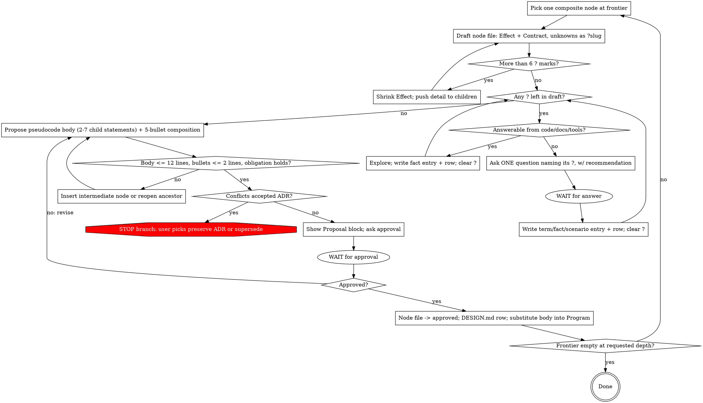

# Constructing Software Stepwise

Stepwise refinement (Dijkstra EWD249/EWD340, Wirth CACM 1971): minute steps, decide as little as possible per step, proof grows with program, representation deferred, back up to any ancestor when needed. Spec not given here → interview builds it, per node.

Cycle, this order: (1) pick ONE node, draft its abstract statement + contract ≤ 6 clauses, unknowns `?slug` → (2) one question per `?`, this node only → (3) propose ONE refinement: pseudocode body + composition argument → (4) user approves / denies → (5) persist node + substitute body into `DESIGN.md ## Program` → next node.

Design is pseudocode until a node is terminal; only there adapt to the real thing — language construct, framework API, platform primitive, service, infra, existing repo fn — written `<target>: <identifier>`. `DESIGN.md ## Program` = whole design, every approved body substituted in place, pseudo + realized lines mixed. Evidence lives inside the node it verifies.

Small refinement → small contract → small vocabulary. Many questions = scope leaking from children.

## Pacing — hard rules

| Rule | Observable test |
|---|---|
| One refinement per approval | Turn proposes children for exactly one node |
| Draft before ask | Node file exists, `Design: draft`, Effect, Contract ≤ 6 clauses, unknowns `?slug`, before first question |
| Interview bounded | Every question names the `?` it clears. No `?` → no question → `Open ambiguities` row, `Resolves at: child of D-NNN` |
| Scope leak gauge | `?` > 6 at draft → shrink Effect, push detail to children, redraft. Questions per node ≤ initial `?` count |
| Interview before proposal | No children while draft has any `?` or open user-owned decision |
| One question per turn | Exactly one question to user. Then wait |
| Approval explicit | Yes to shown Proposal block. Agreement to prose ≠ approval → show block, ask |
| Step small | Refinement body ≤ 12 pseudocode lines; each composition bullet ≤ 2 lines. Longer → insert intermediate node |
| Pseudocode until terminal | Language keyword, library name, or concrete type in composite node = premature representation → move to child |
| Program in sync | Every `-- D-NNN` in `Program` has node row; every approved body appears in `Program`. Substitution same edit as approval |
| Back up freely | Obligation fails → revise children or reopen ancestor |

## Node Kinds

| Kind | Test | Record |
|---|---|---|
| Terminal | Statement = ONE real thing (language construct / framework API / platform primitive / service / repo fn), named `<target>: <identifier>` in `Realization` | Statement + Contract + Realization (`Adaptation` lines) + Evidence |
| Composite | else | Statement + Contract + pseudocode Refinement + every field in [design-ledger.md](references/design-ledger.md) |

Composite → 2–7 child statements. 1 = rename. >7 = missing intermediate node. Terminal = only adaptation point pseudocode → real. "Trivial / obvious / clear enough" not decision words; tables decide.

## Durable Artifacts

Repo convention wins; else:

```text
docs/design/<topic>/
  CONTEXT.md              index: scope, non-goals, term/fact/scenario tables, open ambiguities
  context/terms.md        every term, one ## section
  context/facts.md        every fact, one ## section
  context/scenarios.md    every scenario, one ## section
  DESIGN.md               index: root, frontier, ADRs, node table + Program (whole pseudocode, bodies substituted)
  nodes/D-000-<slug>.md   one node = statement + contract + refinement + evidence = one file
docs/adr/NNNN-<slug>.md   one decision = one file
```

| Dimension | Unit | Why | Index | Format |
|---|---|---|---|---|
| Meaning | `##` section, one file per kind | edited in place | `CONTEXT.md` | [context-ledger.md](references/context-ledger.md) |
| Design + evidence | one file per node; `###` per evidence record | append-only once approved; evidence status flips in place | `DESIGN.md` + `## Program` | [design-ledger.md](references/design-ledger.md) |
| Decision | one file per ADR | supersede, never rewrite | — | [adr-ledger.md](references/adr-ledger.md) |

Rules:
- One claim per unit. Two citable statements → two units.
- `##` heading = anchor: `## CTX-F01 Required runtime` → `facts.md#ctx-f01-required-runtime`. Link anchors.
- Unit first line: ID, status, date. Readable alone.
- Link, never repeat. Definition 1–2 sentences, what it IS. Canonical term + `Avoid:` aliases.
- Caps: context section ≤ 10 lines, evidence record ≤ 4, refinement body ≤ 12, ADR ≤ 40, node ≤ 120. Over → split.
- Index = status + link only, except `DESIGN.md ## Program` (derived: substituted bodies). Unit + row same edit. Create index on first unit.

## Core Loop



### 1. Ground + draft

Read `DESIGN.md`, active node, its `Depends on`, linked ADRs, code, tests, evidence. Pick ONE composite node at frontier. Terminal → Effect + Realization, next node.

Write `nodes/D-NNN-<slug>.md`, `Design: draft`: Statement (one pseudocode line, as parent's body names it) + Effect (1–2 sentences) + Contract (≤ 6 clauses, one line each). Term / decision without entry on disk → `?slug`. Draft = scope fence; interview fills only its holes. Root example, 4 `?`:

```markdown
Statement: `outcome ← run_agent(?run-identity, objective)`
Effect: one Agent Run ends in exactly one terminal outcome and survives process restart.
- Pre: caller supplies ?run-identity + objective
- Post: ?verified-result or typed failure recorded once
- Failure: ?failure-channels
- Invariant: no ?tool-effect duplicated across restart
```

Journal shape, budgets, tool ordering, cancellation → children's `?`. `?` > 6 → shrink Effect, redraft.

### 2. Interview — one question per `?`

Goal: zero `?` in draft.

- Answerable from code / docs / tools / experiment → explore, never ask. Finding → fact entry, clear `?`.
- Else ONE question, shape below, naming its `?`. Wait.
- Each question carries recommended answer + one-line why.
- `?` whose prerequisite `?` unresolved waits.
- Challenge, don't transcribe: conflicts existing entry → "Glossary defines X as A; you mean B — which?"; vague → propose canonical; relationship → scenario probing edge; claim vs code → "Code does X; you said Y — which?"
- Each answer → entry + index row + `?` → anchor link, same turn.
- New term / question with no `?` → not this node. `Open ambiguities` row, `Resolves at: child of D-NNN`.
- Draft clause wrong → fix (may add one `?`). Total `?` ever > 6 → §1, shrink Effect.
- Done iff zero `?` and every user-owned decision draft names answered.

Never: batch questions; ask what code answers; ask without a `?`; propose children mid-interview.

```markdown
**Node:** D-NNN — <operation> · **Resolves:** ?<slug> in <clause> · **Left:** <k> of <n> ?
**Q:** <one question>
**Recommend:** <answer> — <one-line why>
**Else:** <alternative> — <trade-off, one line>
```

### 3. Propose ONE refinement

Parent Statement → Refinement body: pseudocode ≤ 12 lines, 2–7 child statements each tagged `-- D-NNN`, control structure (sequence / choice / loop) lives here, `{ assertion }` line wherever composition leans on a condition. Notation in [design-ledger.md](references/design-ledger.md). No language keyword, library, concrete type — representation, storage, framework → deepest node needing them.

Composition argument (data flow / failures / cleanup / invariants / progress, ≤ 2 lines each) = proof obligation: body preserves parent `{Pre} S {Post}`. Checklist: Refinement Obligation. Fails → revise body or reopen ancestor.

Then STOP. Show block. Nothing else that turn.

```markdown
## Proposal — D-NNN — <statement>
Contract: Pre <…> · Post <…> · Failure <…> · Invariant <…>
Refinement:
    <statement>:
      x ← child_a(…)              -- D-a
      { assertion }
      loop until cond:
        child_b(x)                -- D-b
      → child_c(x)                -- D-c
Composition:
- Data flow: <≤2 lines>
- Failures: <≤2 lines>
- Cleanup: <≤2 lines | n/a: reason>
- Invariants: <≤2 lines>
- Progress: <≤2 lines | n/a: reason>
Decisions: <one line each>
Deferred: <Open ambiguities rows for children of D-NNN → D-x>
ADRs: <checked, none conflict | conflict → protocol>
**Approve D-NNN as above?** yes / change: …
```

### 4. Approve + persist

User owns semantic / risk / compat / hard-to-reverse choices. Approval = explicit yes to block. Then node file → `Design: approved`, fill Refinement / Composition / Decisions / Deferred, + `DESIGN.md` row, + substitute body under its statement line in `## Program` (children tagged `(frontier)`), same turn.

Approved node = composed fn: descendants use Statement + Contract, never re-derive. Reopen only on changed context entry, invariant, dependency, ADR, evidence.

### 5. ADR

Only if ALL: hard to reverse + surprising w/o context + real trade-off. Offer → user approves → binding.

Before Proposal: check linked ADRs. Conflict → STOP branch, Conflict Protocol in [adr-ledger.md](references/adr-ledger.md). Never bypass, weaken, delete, rewrite ADR.

### 6. Implement + verify to requested depth

Design-only → stop at approved frontier. Implementation → refine until every leaf terminal, then adapt: terminal `Realization` names the real thing (`Target: <target>: <identifier>`, `Adaptation` lines pseudo construct → real construct), `Program` line gains `✓ <target>: <identifier>` or becomes the real line.

Evidence: cheapest method covering obligation (types → examples → property → integration → static/proof → model-check → benchmark → fault-injection → observation). One record per (obligation, method), ≤ 4 lines, under node's `## Evidence`. Rules in [design-ledger.md](references/design-ledger.md).

States independent, never inferred from each other: `approved` (design accepted) · `implemented` (code exists) · `verified` (every Contract clause has current passing evidence).

### 7. Propagate change

Context entry, ancestor, ADR, or dependency changes:

1. edit unit in place + row
2. follow `Used by` / `Depends on` to dependents
3. mark nodes + evidence stale — header, row, `Program` tag
4. revisit only invalidated frontier, one node per cycle
5. superseded ADR: keep, link replacement

## Discipline

- Terminology at node needing it.
- Abstract statements, not tech-named components. Pseudocode until terminal; data as `set` / `seq` / `map` / `record` until no algorithm fits without concrete representation.
- Open decision explicit. Silence ≠ approval.
- Authz, privacy, durability, ordering, idempotency threaded through every affected node.
- Stateful → transitions + invariants first. Concurrent / distributed → ownership, atomicity, retries, dupes, reordering, cancellation, partial failure exposed.
- Prototype → fact entries. Prototype ≠ spec.
- Long proof = warning.

## Red Flags — STOP

| Thought | Rule |
|---|---|
| Several questions to save turns | One. Wait |
| Related question, no `?` for it | `Open ambiguities`, child's job. Question count = leak gauge |
| Root needs full vocabulary | Root ≤ 6 coarse clauses. Detail = children |
| Ask first, draft later | Draft first. No draft = no bound |
| Context clear, skip to proposal | Zero `?`, not feeling |
| Design next node too | One node per approval |
| Agreement to prose = approval | Yes to Proposal block only |
| Skip composition bullets | Five bullets ≤ 2 lines. Can't → step too big |
| Composition needs paragraph | Insert intermediate node |
| Pick storage / framework now | Deepest node needing it |
| Write body in Scala / DBOS API, clearer | Composite = pseudocode. Real thing at terminal only |
| Evidence in separate doc | Under the node's `## Evidence`, nowhere else |
| Update `Program` later | Same edit as approval. Out of sync = fix Program |
| Append node to `DESIGN.md` | One node = one file from first write |
| Tests pass → verified | Evidence per Contract clause |
| ADR doesn't apply | Conflict Protocol decides |
| Reopening ancestor = failure | Normal |
| Ask user a fact in code | Explore |

## Completion

Done at requested depth when: frontier approved; every statement has contract; each parent justified by ≤ 12-line body + ≤ 2-line-bullet composition; `Program` reads top-down with every line approved, frontier-tagged, or realized; ADRs satisfied or superseded; another engineer / agent continues from files alone.
