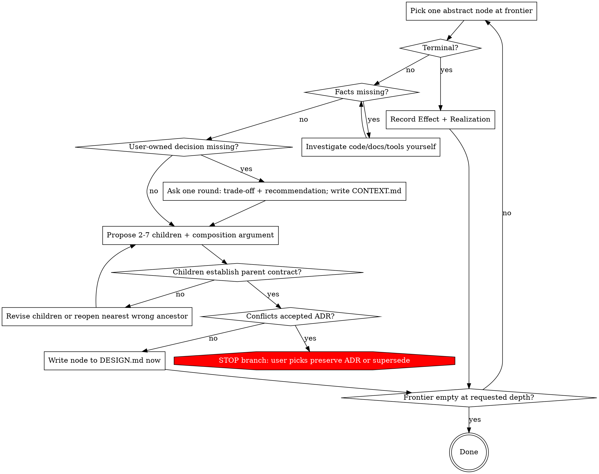

# Constructing Software Stepwise

Pick one abstract design node → establish shared meaning that node needs → replace w/ concrete children whose composition preserves parent contract → repeat. Refinement = spine. Questions serve active node only; no open-ended requirements interview.

## Node Kinds — observable, no judgment hatch

| Kind | Test | Record |
|---|---|---|
| **Terminal** | Effect = ONE existing fn, lib call, platform feature, or repo pattern, nameable in `Realization` | Effect + Realization only. No children, no composition argument |
| **Composite** | Anything else | Every field in [design-ledger.md](references/design-ledger.md) |

Fan-out: composite → 2–7 children. 1 child = rename, not refinement. >7 = missing intermediate node.

"Material", "trivial", "substantial", "obvious" = not decision words. Kind table decides.

## Durable Artifacts

Four dimensions, four files. Repo convention wins; else `docs/design/<topic>/` + repo ADR dir.

| Artifact | Records | Read before create/change |
|---|---|---|
| `CONTEXT.md` | Meaning: scope, vocab, confirmed facts, constraints, scenarios, non-goals | [context-ledger.md](references/context-ledger.md) |
| `DESIGN.md` | Approved refinement tree: contracts, children, composition, invariants, deferred boundaries | [design-ledger.md](references/design-ledger.md) |
| `EVIDENCE.md` | What checked vs which obligation, result, limits | [evidence-ledger.md](references/evidence-ledger.md) |
| `docs/adr/NNNN-<slug>.md` | Hard-to-reverse trade-offs | [adr-ledger.md](references/adr-ledger.md) |

Create file on first qualifying record. No empty scaffolds. No file as catch-all for another dimension.

## Core Loop



### 1. Ground

Read existing CONTEXT, approved nodes, applicable ADRs, code, tests, evidence. Pick ONE composite node at frontier. Siblings/descendants wait until active.

### 2. Understand locally

Resolve only terms + decisions active node needs.

- Fact findable in code/docs/tools/experiment → agent investigates. Never asks user.
- Product semantics, risk acceptance, compatibility, hard-to-reverse choice → user decides.
- Ask only when prerequisites settled AND answer changes current refinement.
- Independent questions → one batched round. Each: trade-off + concrete recommendation.
- Scenarios + counterexamples expose ambiguous terms, boundaries, failures, negatives.
- Distinction changes active node's contract clause → resolve now. Else → `Deferred boundaries`.

Write resolved meaning to `CONTEXT.md` as it lands. Never end-of-session summary.

### 3. Refine

State parent Effect + Contract. Propose 2–7 children. Decide only what contract or active constraint requires.

Check Refinement Obligation ([design-ledger.md](references/design-ledger.md)): coverage, safety, assumptions, composition, invariants, progress, budgets, ADR compat. Fail → revise children or reopen nearest wrong ancestor. Never bury mismatch in impl detail.

### 4. Approve + persist

Agent recommends. User owns semantic / risk / compat / hard-to-reverse choices. Approved → write node to `DESIGN.md` immediately. Record = contract AND why children compose. Component list or task plan ≠ refinement record.

Approved node = composed fn: descendants use contract, never re-derive. Reopen only on changed assumption, context term, invariant, dependency, ADR, or evidence.

### 5. ADR

Create only if ALL: hard to reverse + surprising w/o context + real trade-off. Offer → user approves → binding constraint.

Before approving any node: check applicable ADRs. Conflict → STOP branch, run Conflict Protocol ([adr-ledger.md](references/adr-ledger.md)). Never bypass, weaken, delete, or rewrite ADR to fit design.

### 6. Implement + verify to requested depth

Design-only → stop at coherent approved frontier. Implementation → refine until every leaf terminal.

Evidence: cheapest method covering obligation (types → examples → property → integration → static/proof → model-check → benchmark → fault-injection). Record in `EVIDENCE.md`, link node.

Three independent states. Never infer one from another:

- **approved** — semantic design accepted
- **implemented** — code/config exists
- **verified** — every Contract clause has current passing evidence

### 7. Propagate change

Context, ancestor, ADR, or dependency changes:

1. record change at source
2. find dependent nodes
3. mark nodes + their evidence stale
4. revisit only invalidated frontier
5. superseded ADR: keep, link replacement
6. resume

Stable nodes untouched.

## Turn Output — every design turn, this shape, this order

```markdown
## D-NNN — <operation>
Contract: <pre / post / failure / invariants, ≤4 lines>
Refines into: D-a <op>, D-b <op>, ...   |  terminal → <primitive>
Composition: <why children establish contract; failures + cleanup covered>
Decided: <approved this turn>
Deferred: <question → node/trigger where it matters>
Open: <user decisions needed | obligations w/o evidence>
```

Empty slot → `none`. Stable ancestors → one line, never replayed.

## Discipline

- Terminology just-in-time, at node needing precision.
- Semantic ops, not components named after anticipated tech.
- Open decision stays explicit. Silence ≠ approval.
- Thread authz, privacy, durability, ordering, idempotency through every affected node.
- Stateful → transitions + invariants before distributing logic across handlers/services.
- Concurrent/distributed → expose ownership, atomicity, retries, dupes, reordering, cancellation, partial failure.
- Pure decision fn + explicit effect interpretation when it simplifies. Don't force FP.
- Prototype discovers facts → promote to context/design/evidence. Prototype ≠ spec.

## Red Flags — STOP

| Thought | Reality |
|---|---|
| "Obvious node, skip composition argument" | Composite = all fields. Pass terminal test or write it |
| "User said 'sounds good'" | Approval binds recorded contract only. Show it, get yes |
| "Write CONTEXT.md at end" | Lossy. Write on resolution |
| "Tests pass → verified" | Verified = EVIDENCE record per Contract clause |
| "ADR doesn't really apply here" | Conflict Protocol decides, not you |
| "All known primitives, no refinement needed" | Name each in Realization. Can't → composite |
| Asking user for fact that lives in code | Investigate |

## Completion

Requested depth done when: frontier approved; every exposed op has contract; each parent justified by children; ADRs satisfied or explicitly superseded; another engineer/agent continues from artifacts alone.
