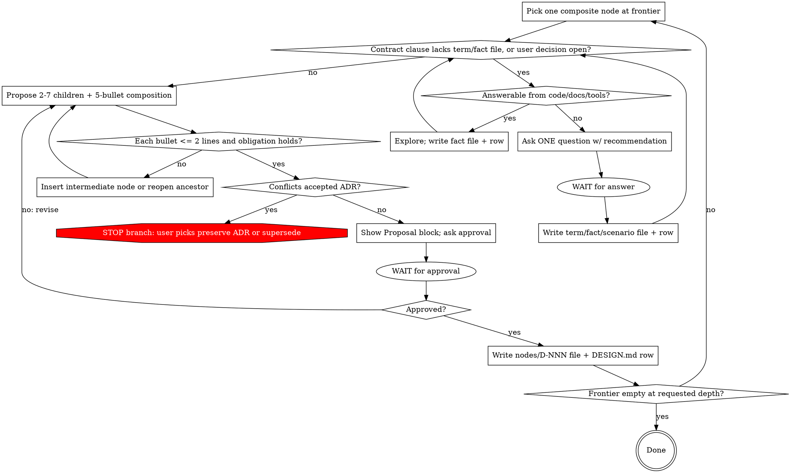

# Constructing Software Stepwise

Dijkstra: *"compose the program in minute steps, deciding each time as little as possible"* (EWD249); *"let correctness proof and program grow hand in hand"* (EWD340). Wirth: *"defer those decisions which concern details of representation as long as possible"*; *"revoke earlier decisions, and back up, if necessary even to the top"* (CACM 1971).

Cycle: one node → interview until its meaning shared → propose ONE refinement w/ composition argument (= proof obligation) → user approves → persist → next node. One node per cycle. Never two.

Classic method assumes spec given. Here spec not given — interview builds it, one question at a time, per node.

## Pacing — hard rules

| Rule | Observable test |
|---|---|
| One refinement per approval | Turn proposes children for exactly one node. Children for second node same turn = violation |
| Interview before proposal | No children proposed while any Contract clause of active node lacks linked term/fact file, or any user-owned decision open |
| One question per turn | Message has exactly one question aimed at user. Then wait |
| Approval explicit | User says yes to shown Proposal block. "Sounds good" to prose summary ≠ approval → show block, ask |
| Step small | Each composition bullet ≤ 2 lines. Longer → step too big → insert intermediate node |
| Back up freely | Obligation fails → revise children or reopen ancestor. Reopening ≠ failure |

## Node Kinds — observable, no judgment hatch

| Kind | Test | Record |
|---|---|---|
| **Terminal** | Effect = ONE existing fn, lib call, platform feature, or repo pattern, nameable in `Realization` | Effect + Realization only |
| **Composite** | Anything else | Every field in [design-ledger.md](references/design-ledger.md) |

Fan-out: composite → 2–7 children. 1 child = rename. >7 = missing intermediate node.

"Material", "trivial", "substantial", "obvious", "clear enough" = not decision words. Tables decide.

## Durable Artifacts — one item per file

Four dimensions. Repo convention wins; else:

```text
docs/design/<topic>/
  CONTEXT.md                            index only: scope, non-goals, item tables
  context/terms/<slug>.md               one term
  context/facts/CTX-F01-<slug>.md       one fact
  context/scenarios/CTX-S01-<slug>.md   one scenario
  DESIGN.md                             index only: root, frontier, ADRs, node table
  nodes/D-000-<slug>.md                 one node = one refinement step
  EVIDENCE.md                           index only: record table
  evidence/EV-D000-01-<slug>.md         one record
docs/adr/NNNN-<slug>.md                 one decision
```

| Dimension | Item | Index | Format |
|---|---|---|---|
| Meaning | `context/{terms,facts,scenarios}/…` | `CONTEXT.md` | [context-ledger.md](references/context-ledger.md) |
| Design | `nodes/D-NNN-<slug>.md` | `DESIGN.md` | [design-ledger.md](references/design-ledger.md) |
| Evidence | `evidence/EV-DNNN-NN-<slug>.md` | `EVIDENCE.md` | [evidence-ledger.md](references/evidence-ledger.md) |
| Decision | `docs/adr/NNNN-<slug>.md` | — | [adr-ledger.md](references/adr-ledger.md) |

Atomic rules (detail per ledger):
- One claim per file. Two independently citable statements → two files.
- Self-describing header: `Kind`, ID, `Index` link, status, date. Readable alone.
- Link, never repeat. Definitions 1–2 sentences: what it IS, not what it does. Canonical term + `Avoid:` aliases.
- Size caps: term/fact/scenario/evidence ≤ 30 lines, ADR ≤ 40, node ≤ 80. Over → packed two items. Split.
- Index holds status + link, never body. Item + row same edit. Create index on first item. No scaffolds.

## Core Loop



### 1. Ground

Read `DESIGN.md` index, active node file, its `Depends on` items, linked ADRs, code, tests, evidence. Pick ONE composite node at frontier. Terminal? → record Effect + Realization, next node. Siblings / descendants wait.

### 2. Interview — one question at a time

Goal: every clause active node's Contract will need has shared meaning, on disk.

- Answerable from code / docs / tools / experiment → explore, never ask. Finding → fact file.
- Else ONE question, shape below. Wait for answer before anything else.
- Every question carries recommended answer + one-line why.
- Walk decision tree: question whose prerequisite unanswered waits its turn.
- Challenge, don't transcribe: term conflicts existing term file → *"Glossary defines 'cancellation' as X, you seem to mean Y — which?"*; vague / overloaded → propose canonical: *"'account' — Customer or User? Different things."*; relationship → invent scenario probing edge; user claim vs code → *"Code cancels entire Orders; you said partial possible — which is right?"*
- Each answer → term / fact / scenario file + index row, same turn.
- **Done iff ALL:** every term node will name has file; every fact Contract relies on has file; every user-owned decision node needs answered; no `Open ambiguities` row names this node. Then stop asking.

Don't: batch questions; ask what code answers; ask downstream nodes' questions; propose children mid-interview.

Question turn — this shape:

```markdown
**Node:** D-NNN — <operation> · **Resolved:** <n> terms, <m> facts · **Open:** <k>
**Q:** <one question>
**Recommend:** <answer> — <one-line why>
**Else:** <alternative> — <trade-off, one line>
```

### 3. Propose ONE refinement

State parent Effect + Contract. Propose 2–7 children + composition argument: data flow / failures / cleanup / invariants / progress, ≤ 2 lines each. Decide as little as possible: representation, storage, framework → deferred to deepest node that needs them.

Composition argument = proof obligation: children preserve parent `{Pre} S {Post}`. Checklist = Refinement Obligation ([design-ledger.md](references/design-ledger.md)). Fails → revise children or reopen ancestor. Never bury mismatch in impl detail.

Then STOP. Show Proposal block. Ask approval. Nothing else in that turn.

```markdown
## Proposal — D-NNN — <operation>
Contract: Pre <…> · Post <…> · Failure <…> · Invariant <…>
Refines into: D-a <op> · D-b <op> · …
Composition:
- Data flow: <≤2 lines>
- Failures: <≤2 lines>
- Cleanup: <≤2 lines | n/a: reason>
- Invariants: <≤2 lines>
- Progress: <≤2 lines | n/a: reason>
Decisions: <one line each>
Deferred: <question → D-x>
ADRs: <checked, none conflict | conflict → protocol>
**Approve D-NNN as above?** yes / change: …
```

### 4. Approve + persist

Agent recommends. User owns semantic / risk / compat / hard-to-reverse choices. Approval = explicit yes to Proposal block. Then write `nodes/D-NNN-<slug>.md` + `DESIGN.md` row immediately. Record = contract AND why children compose. Component list or task plan ≠ refinement record.

Approved node = composed fn: descendants use contract, never re-derive. Reopen only on changed context item, invariant, dependency, ADR, or evidence.

### 5. ADR

Create only if ALL: hard to reverse + surprising w/o context + real trade-off. Offer → user approves → binding. One decision per file.

Before Proposal: check linked ADRs. Conflict → STOP branch, Conflict Protocol ([adr-ledger.md](references/adr-ledger.md)). Never bypass, weaken, delete, rewrite ADR to fit design.

### 6. Implement + verify to requested depth

Design-only → stop at coherent approved frontier. Implementation → refine until every leaf terminal.

Evidence: cheapest method covering obligation (types → examples → property → integration → static/proof → model-check → benchmark → fault-injection). Each record → own `evidence/` file + row; link from node's `Realization`.

Three independent states. Never infer one from another:

- **approved** — semantic design accepted
- **implemented** — code / config exists
- **verified** — every Contract clause has current passing evidence

### 7. Propagate change

Context item, ancestor, ADR, or dependency changes:

1. record change in item's own file + row
2. follow `Used by` / `Depends on` links to dependents
3. mark nodes + their evidence stale — header AND row
4. revisit only invalidated frontier, one node per cycle
5. superseded ADR: keep, link replacement
6. resume

Stable nodes untouched.

## Discipline

- Terminology just-in-time, at node needing precision.
- Semantic ops, not components named after anticipated tech. Representation decided at deepest node needing it.
- Program + data refined in parallel; data representation postponed until no realizable algorithm fits without it (Wirth).
- Open decision stays explicit. Silence ≠ approval.
- Thread authz, privacy, durability, ordering, idempotency through every affected node.
- Stateful → transitions + invariants before distributing logic.
- Concurrent / distributed → expose ownership, atomicity, retries, dupes, reordering, cancellation, partial failure.
- Prototype discovers facts → fact files. Prototype ≠ spec.
- Simple structures; long proof = warning, not achievement (Dijkstra).

## Red Flags — STOP

| Thought | Reality |
|---|---|
| "Three quick questions to save turns" | One. Wait. Next |
| "Context clear enough, skip to proposal" | Done-iff test, not feeling. Missing file → ask |
| "User will approve anyway, design D-030 too" | One node per approval. Stop after Proposal block |
| "Sounds good = approved" | Show Proposal block, get yes to it |
| "Composition obvious, skip bullets" | Five bullets, ≤2 lines each. Can't → step too big |
| "Composition needs a paragraph" | Step too big. Insert intermediate node |
| "Pick Postgres now, saves time later" | Representation → deepest node needing it |
| "Append node to DESIGN.md, split later" | One node = one file from first write |
| "Tests pass → verified" | Evidence record per Contract clause |
| "ADR doesn't really apply" | Conflict Protocol decides |
| "Reopening ancestor = failure" | Wirth: back up even to top. Normal |
| Asking user fact that lives in code | Explore |

## Completion

Requested depth done when: frontier approved; every exposed op has contract; each parent justified by ≤2-line-bullet composition; ADRs satisfied or explicitly superseded; another engineer / agent continues from files alone.
